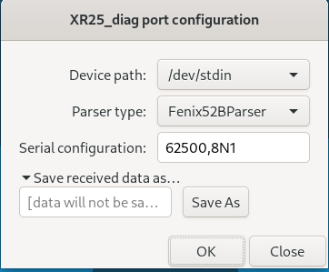
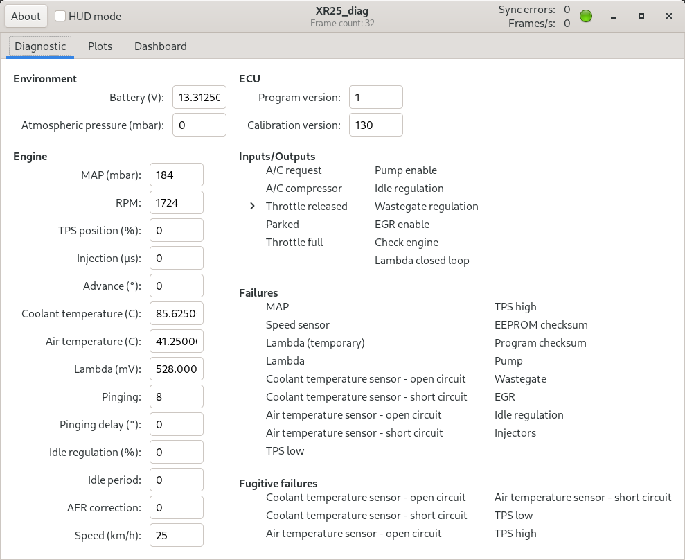
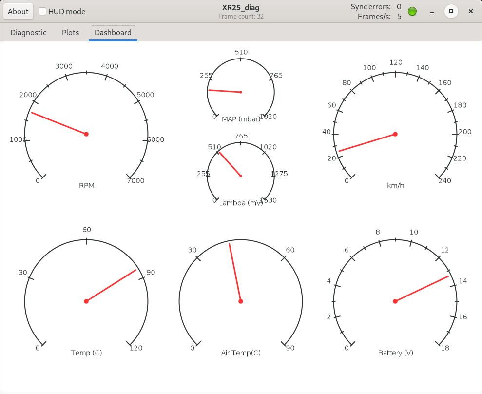

# XR25_diag
XR25_diag is a simple program that aids in the diagnosis of old Renault XR25-compliant vehicles such as the Renault R19 or the R21.
It has been successfully used for the diagnosis of an old Renault 21 TXI (1992), where in light of the data it was concluded that one wire of the TPS (Throttle Position Sensor) was faulty.

This is a legacy project and it is not maintained anymore.  I hope that it can nevertheless still be useful to other people.


## Build instructions
XR25_diag depends on `gtkmm-3.0`, `cairomm`, `pkg-config`, GNU `make`, and a working C++ toolchain.
On ArchLinux, dependencies can be installed as follows:
```bash
$ pacman -S gcc make pkgconf gtkmm cairomm
```

Then, to build xr25_diag:
```bash
$ make # or `make DEBUG=1`, to also enable debug code
```

## Hardware
The interface with the ECU diagnostic port is based on the FTDI FT232RL; see [here](https://github.com/jalopezg-git/xr25_diag/blob/master/doc/hardware.pdf) for more information.

## Configuration


The concrete format of the ECU diagnostic information may vary depending on the car model.
This program includes the following parsers:
- `Fenix1Parser`: parses Siemens Fenix1 frames.  This parser has been reverse engineered from other proprietary software and is untested.
- `Fenix3Parser`: parses Siemens Fenix3 frames.  It is valid for Renault 19, some Renault 21 and probably also R25.
- `Fenix52Bparser`: parses Siemens Fenix 52-byte frames.  This parser works with the R21 2.0 TXI.

Sessions can be saved to a file on disk.
The `replay_file.sh` script allows a file to be replayed later.

For privacy reasons, no full test files with recorded sessions are distributed in the repository.
Should you need any, please contact me.

## Usage


The main window contains three tabs that, respectively, show the raw parsed data, a few time series plots, and a simple dashboard with analog gauges.
The window decoration shows some common information, such as the link state (i.e., the red / green ball), number of frames received, and the data acquisition frequency.




Additionally, for plots and gauges in the dashboard, the head-up display (HUD) mode can be enabled, which renders a mirrored image to be projected on the windshield.
